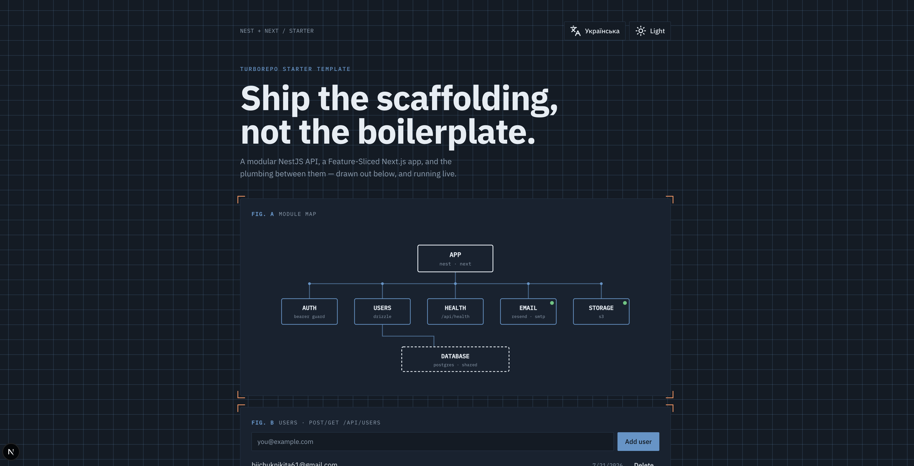

# Nest + Next Turborepo starter



A pnpm/Turborepo starter with:

- `apps/api`: NestJS modular monolith with Drizzle ORM and PostgreSQL
- `apps/web`: Next.js App Router organized with Feature-Sliced Design
- `packages/shared`: framework-agnostic contracts and types grouped by entity
- `packages/eslint-config`: shared flat ESLint presets (`next`, `nest`) consumed by both apps
- `packages/typescript-config`: shared `tsconfig` presets (`base`, `nextjs`, `nestjs`, `library`)

> [!IMPORTANT]
> Demo endpoints are intentionally public for local evaluation. They are not
> production authentication examples; review or remove them before deploying a
> real application.

Read the [project overview](./docs/project-overview.md) and [architecture](./docs/architecture.md) for how the template is structured.

## Documentation

This is the only README. Deeper guides live as named docs (not extra READMEs):

| Doc                                                        | What it covers                                         |
| ---------------------------------------------------------- | ------------------------------------------------------ |
| [`docs/project-overview.md`](./docs/project-overview.md)   | What this template is, stack, repo layout              |
| [`docs/architecture.md`](./docs/architecture.md)           | FSD web + Nest modular monolith, packages, data flow   |
| [`docs/context-system.md`](./docs/context-system.md)       | The 6 `context/` files used to build with agents       |
| [`context/code-standards.md`](./context/code-standards.md) | Implementation rules (FSD, Nest layers, forms, errors) |

Screenshots and other attachments live under [`docs/assets/`](./docs/assets/) (e.g. the demo image above) or root [`assets/`](./assets/). Runtime public files for Next belong in `apps/web/public/`.

## Start

```bash
pnpm install
cp env/api.example.env env/api.local.env
cp env/web.example.env env/web.local.env
pnpm infrastructure:up
pnpm db:generate
pnpm db:migrate
pnpm db:seed
pnpm dev
```

Web runs at http://localhost:3000 and API at http://localhost:4000/api.

All environment files live in the root `env/` directory. Commit the `*.example.env` templates; `*.local.env` files are ignored and hold developer-specific values. Nest, Drizzle, seed commands, and Next load their corresponding local files automatically.

API documentation is available at http://localhost:4000/api/docs.

## After using this template

- Rename the workspace packages and project metadata.
- Complete the product-specific files under `context/`.
- Choose and configure an authentication provider.
- Review or remove the public demo endpoints.
- Replace the example users module with your first real domain module.
- Configure and validate deployment environment variables.

## PostgreSQL, authentication, email, and storage

The core template is vendor-neutral PostgreSQL. Local development uses the PostgreSQL container from Compose, while production can use any PostgreSQL-compatible host that provides a standard `DATABASE_URL`, such as Neon, AWS RDS, Railway, Render, Crunchy Bridge, or a self-hosted instance.

Authentication is deliberately pluggable and no provider SDK is installed. The Nest auth module exposes a generic bearer-token guard backed by an `AuthVerifier` port. It fails closed by default: with no adapter configured, every guarded route rejects every request. To add Better Auth, Clerk, Auth.js, or another provider, implement `AuthVerifier` and pass the adapter class to `AuthModule.register({ verifier: YourAuthVerifier })`. The web adapter should obtain its provider's token and pass it through the normal `Authorization` request header.

Email (`EmailModule`/`EmailService` in `apps/api/src/modules/email`) tries Resend first, then falls back to SMTP via Nodemailer if Resend is unconfigured or the request fails. Configure `RESEND_API_KEY` and/or `EMAIL_HOST`/`EMAIL_PORT`/`EMAIL_USER`/`EMAIL_PASS` (see `env/api.example.env`). With neither configured, `send()` logs a warning and returns `{ success: false, provider: 'noop' }` instead of throwing — a failed notification email shouldn't break the calling flow.

Emails triggered by application events go through a Redis-backed queue (BullMQ via `QueueModule`, a global connection like `DatabaseModule`) instead of sending inline, so a slow or unreachable provider never blocks the request that triggered them. `UsersService.create()` reaches that queue through its domain-owned `WelcomeEmailPort`; `EmailQueueWelcomeEmailAdapter` bridges the port to the technical `EmailQueueService`. Follow the same port-and-adapter pattern for other domain side effects. `REDIS_URL` defaults to `redis://localhost:6379`, matching the `redis` Compose service; `pnpm infrastructure:up` starts both Postgres and Redis. Like email itself, queueing degrades gracefully: a failed enqueue is logged and swallowed, never thrown back at the caller.

Storage (`StorageModule`/`StorageService` in `apps/api/src/modules/storage`) wraps AWS S3 (`upload`, `delete`, `getSignedDownloadUrl`, `getSignedUploadUrl`). It works against real AWS S3 by default; setting `AWS_S3_ENDPOINT` points the same client at any S3-compatible provider (Cloudflare R2, MinIO, ...) with no code change. Unlike email, storage calls throw when unconfigured or on failure — a failed upload usually means the caller's primary operation failed, not a best-effort side effect.

Import `EmailModule`/`StorageModule` into any feature module that needs to inject `EmailService`/`StorageService`; both are already registered in `AppModule`.

## Quality and operations

```bash
pnpm test
pnpm test:api
pnpm --filter @root/api test:integration
pnpm test:e2e
pnpm lint
pnpm typecheck
pnpm build
pnpm clean
```

The API includes structured JSON logging with request IDs, authorization/cookie redaction, Helmet security headers, global rate limiting (Nest `ThrottlerGuard` on every route — default 100 requests / 60s, tunable via `THROTTLE_TTL_MS` / `THROTTLE_LIMIT`), Swagger/OpenAPI, sanitized errors, and graceful database shutdown. CI runs format check, lint, typecheck, unit tests, and build.

Run `docker compose up --build` for the complete local stack, or `pnpm infrastructure:up` when running the apps with `pnpm dev`. No external account is required. Use a direct PostgreSQL connection for migrations; runtime deployments may use a compatible pooler. The Postgres.js client has prepared statements disabled for pooler compatibility.

A Husky `pre-commit` hook runs `lint-staged`, which lints and formats only staged files, scoped per app so each app's own `eslint.config.mjs` is used. Dependency updates are automated with Renovate (`renovate.json`); grouped, non-major devDependency bumps land weekly, and major bumps wait for approval via the dependency dashboard issue. Renovate needs the [Renovate GitHub App](https://github.com/apps/renovate) installed on the repo once it is pushed to GitHub.

## Architecture

Each API business module owns its domain, application use cases, infrastructure, HTTP presentation, and Drizzle schema. The database module only provides shared connection infrastructure. Drizzle discovers module-owned schemas through `src/modules/**/infrastructure/persistence/*.schema.ts`.

Modules communicate through exported application services or explicit contracts—not another module's database tables or schema files.

The web app follows FSD: `app -> widgets -> features -> entities -> shared`. Next's routing root remains `src/app`; FSD business layers sit beside it. Public imports should go through each slice's `index.ts`.

Related feature slices may sit under an organizational group folder (not a layer), for example `features/user/create-user` and `features/user/delete-user`, or `features/test/email`. Imports still target the slice public API (`@/features/user/create-user`), never a deep `ui/` path.

Forms use React Hook Form with Zod schemas and shadcn `<Field />` primitives (see [shadcn React Hook Form](https://ui.shadcn.com/docs/forms/react-hook-form)). Prefer `Controller` + `zodResolver` over hand-rolled `FormData` parsing for any user-facing form.

The web app is configured for shadcn/ui. Generated and reusable UI primitives belong in `apps/web/src/shared/ui` and are imported through `@/shared/ui`; `components.json` points the shadcn CLI to that location.

Light and dark modes use `next-themes` with system preference as the default. The app-level provider applies a persisted theme class to the document, while the user-facing toggle lives in the `features/toggle-theme` FSD slice.

Localization uses `next-intl` with English (`/`, internally `/en`) and Ukrainian (`/uk`). Locale routing lives in `apps/web/src/i18n`, translations live in `apps/web/messages`, and the locale switcher preserves the active pathname.

See [`docs/architecture.md`](./docs/architecture.md) and [`context/architecture.md`](./context/architecture.md) for the full system picture and invariants.

## Localized API errors

The API returns stable, language-neutral error codes instead of translated or raw exception messages:

```json
{
  "error": {
    "code": "user.emailTaken",
    "details": {}
  },
  "statusCode": 409,
  "timestamp": "2026-07-16T12:00:00.000Z",
  "path": "/api/users"
}
```

Codes and the response envelope are defined in `packages/shared/src/api-error`. The Nest exception filter sanitizes errors, and each client maps `error.code` to its own translation catalog with `common.internal` as the safe fallback. Keep `details` structured and language-neutral for field names, validation rule identifiers, or interpolation values; never put user-facing prose or sensitive internal data there.

Shared cross-application models follow the same entity-first idea. For example, `packages/shared/src/user/contracts.ts` contains operation inputs while `types.ts` contains shared entity representations. Consumers import from `@root/shared/user`; split those files further only when they become difficult to navigate.
